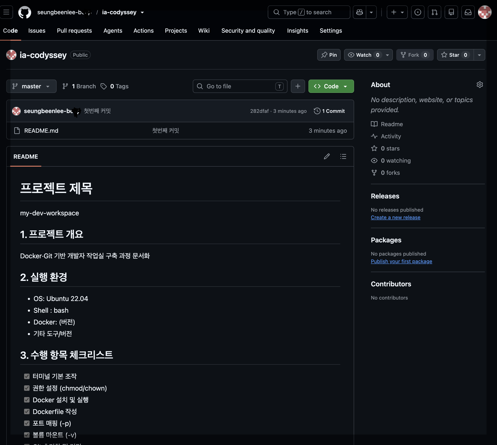

# 프로젝트 제목
my-dev-workspace

## 1. 프로젝트 개요
Docker·Git 기반 개발자 작업실 구축 과정 문서화

## 2. 실행 환경
- OS: Ubuntu 22.04/ MacOS 15.7.4
- Shell : bash/zsh
- Docker: 28.5.2
- Git : 2.53.0

## 3. 수행 항목 체크리스트
- [x] 터미널 기본 조작
- [x] 권한 설정 (chmod)
- [x] Docker 설치 및 실행
- [x] Dockerfile 작성
- [x] 포트 매핑 (-p)
- [x] 볼륨 마운트 (-v)
- [x] Git 초기화 및 커밋
- [x] GitHub 원격 저장소 연동

## 4. 수행 로그

### 4.1 터미널 조작 로그 기록

| 항목 | 실행한 명령어 | 출력 결과 |
|------|--------------|-----------|
| 현재 위치 확인 | `pwd` | `/` |
| 목록 확인(숨김 파일 포함)| `ls -al` | [결과 보기](#ls--al-출력-결과) |
| 이동 | `cd [디렉토리명 : bin]` |`root@ed8479b97f5b:/bin#` |
| 생성 (폴더) | `mkdir [디렉토리명 : hello]` | `root@ed8479b97f5b:/# cd hello` <br> `root@ed8479b97f5b:/hello#` | 
| 생성 (빈 파일) | `touch [파일 : hello.txt]` | `root@ed8479b97f5b:/hello# ls -al`<br>`total 0<br>drwxr-xr-x 1 root`<br>`root 18 Jul 27 11:40 .`<br>`drwxr-xr-x 1 root root 16 Jul 27 11:36 ..`<br>`-rw-r--r-- 1 root root  0 Jul 27 11:40 hello.txt`<br>|
| 복사 | `cp [복사 대상 위치 및 파일 이름 : /hello/hello.txt] [목적지 위치 : /hello2/]` | [결과 보기](#cp-이하-생략-출력-결과) |
| 이동/이름변경 | `mv [이동 대상/ 이름 변경 대상 위치 파일 이름 : /hello/hello.txt] [목적지 위치 : /hello3/]` | [결과 보기](#mv-이하-생략-출력-결과-이동) |
| 삭제 | `rm 삭제 대상` | [결과 보기](#rm-hello3txt-출력-결과) |
| 파일 내용 확인 | `cat [파일명 : hello.txt]` | 출력값 없음 |

#### `ls -al` 출력 결과
```bash
drwxr-xr-x   1 root root   6 Jul 27 11:09 .
drwxr-xr-x   1 root root   6 Jul 27 11:09 ..
-rwxr-xr-x   1 root root   0 Jul 27 11:09 .dockerenv
lrwxrwxrwx   1 root root   7 Jun 27 02:04 bin -> usr/bin
drwxr-xr-x   1 root root   0 Apr 18  2022 boot
drwxr-xr-x   5 root root 340 Jul 27 11:09 dev
drwxr-xr-x   1 root root  56 Jul 27 11:09 etc
drwxr-xr-x   1 root root   0 Apr 18  2022 home
lrwxrwxrwx   1 root root   7 Jun 27 02:04 lib -> usr/lib
lrwxrwxrwx   1 root root   9 Jun 27 02:04 lib32 -> usr/lib32
lrwxrwxrwx   1 root root   9 Jun 27 02:04 lib64 -> usr/lib64
lrwxrwxrwx   1 root root  10 Jun 27 02:04 libx32 -> usr/libx32
drwxr-xr-x   1 root root   0 Jun 27 02:04 media
drwxr-xr-x   1 root root   0 Jun 27 02:04 mnt
drwxr-xr-x   1 root root   0 Jun 27 02:04 opt
dr-xr-xr-x 225 root root   0 Jul 27 11:09 proc
drwx------   1 root root  30 Jun 27 02:12 root
drwxr-xr-x   1 root root  32 Jun 27 02:12 run
lrwxrwxrwx   1 root root   8 Jun 27 02:04 sbin -> usr/sbin
drwxr-xr-x   1 root root   0 Jun 27 02:04 srv
dr-xr-xr-x  11 root root   0 Jul 27 11:09 sys
drwxrwxrwt   1 root root   0 Jun 27 02:12 tmp
drwxr-xr-x   1 root root  10 Jun 27 02:04 usr
drwxr-xr-x   1 root root  90 Jun 27 02:12 var
```
#### `cp [이하 생략..]` 출력 결과
```bash
root@ed8479b97f5b:/hello# cd ..
root@ed8479b97f5b:/# cd hello2 
root@ed8479b97f5b:/hello2# ls -al
total 0
drwxr-xr-x 1 root root  0 Jul 27 11:50 .
drwxr-xr-x 1 root root 28 Jul 27 11:50 ..
-rw-r--r-- 1 root root  0 Jul 27 11:58 hello.txt
root@ed8479b97f5b:/hello2# 
```

#### `mv [이하 생략..]` 출력 결과 (이동)
```bash
root@ed8479b97f5b:/hello3# ls -al
total 0
drwxr-xr-x 1 root root 18 Jul 27 12:01 .
drwxr-xr-x 1 root root 40 Jul 27 11:59 ..
-rw-r--r-- 1 root root  0 Jul 27 11:40 hello.txt
```

#### `mv [이하 생략..]` 출력 결과 (이름 변경)
```bash
root@ed8479b97f5b:/hello3# mv hello.txt hello3.txt
root@ed8479b97f5b:/hello3# ls -al
total 0
drwxr-xr-x 1 root root 20 Jul 27 12:05 .
drwxr-xr-x 1 root root 40 Jul 27 11:59 ..
-rw-r--r-- 1 root root  0 Jul 27 11:40 hello3.txt
```

#### `rm hello3.txt` 출력 결과
```bash
root@ed8479b97f5b:/hello3# ls -al
total 0
drwxr-xr-x 1 root root  0 Jul 27 12:07 .
drwxr-xr-x 1 root root 40 Jul 27 11:59 ..
```


### 4.2 권한 실습 및 증거 기록

#### 4.2.1 권한 확인용 폴더 및 파일 생성
```bash
root@802d4dd99f62:/# mkdir -p ~/permission-lab
root@802d4dd99f62:~# cd permission-lab
root@802d4dd99f62:~/permission-lab# touch sample.txt
root@802d4dd99f62:~/permission-lab# mkdir sample-dir
```

#### 4.2.2 현재 권한 확인
명령어

```bash
$ stat -c '%A %a %U:%G %n' sample.txt sample-dir
```

기본 `stat` 명령어는 파일 크기, 접근 시간, 수정 시간 등 여러 정보를 함께 출력한다. 이번 실습에서는 권한과 소유권 정보만 필요하므로 `-c` 옵션을 사용해 출력 형식을 직접 지정하였다.

각 출력 형식 지정자의 의미는 다음과 같다.

| 형식   | 의미                |
| ---- | ----------------- |
| `%A` | 파일 권한을 문자 형식으로 출력 |
| `%a` | 파일 권한을 숫자 형식으로 출력 |
| `%U` | 소유자 이름을 출력        |
| `%G` | 소유 그룹 이름을 출력      |
| `%n` | 파일 또는 디렉터리 이름을 출력 |


출력 결과
```bash
-rw-r--r-- 644 root:root sample.txt
drwxr-xr-x 755 root:root sample-dir
```
문자 형식은 세 글자씩, 숫자 형식은 한 자리씩 묶여 하나의 사용자 대상을 나타낸다. 이를 표로 정리하면 다음과 같다.

| 적용 대상 | 문자 형식 | 숫자 형식 | 의미 |
|---|---|---:|---|
| 소유자 | 첫 번째 세 글자 | 첫 번째 숫자 | 파일 또는 디렉터리를 소유한 사용자의 권한 |
| 그룹 | 두 번째 세 글자 | 두 번째 숫자 | 해당 파일이나 디렉터리에 지정된 그룹의 권한 |
| 기타 사용자 | 세 번째 세 글자 | 세 번째 숫자 | 소유자도 아니고 지정된 그룹에도 속하지 않는 사용자의 권한 |

파일과 폴더는 문자 형식 맨 앞의 `-`와 `d`로 구분된다. <br>
각각의 알파벳과 숫자가 의미하는 것은 다음과 같다. <br>
숫자 형식의 경우 각 자릿수를 해당하는 권한의 숫자 값을 모두 더한 값으로 계산한다.

| 권한 | 숫자 값 |
|---|---:|
| 읽기 `r` | `4` |
| 쓰기 `w`| `2` |
| 실행 (폴더의 경우 접근) `x`| `1` |
| 권한 없음 `-` | `0` |

출력 결과를 해석하면 다음과 같다.<br>
sample.txt : 소유자 -> 읽기와 쓰기 가능, 그룹 -> 읽기 가능, 기타 사용자 -> 읽기 가능<br>
sample-dir : 소유자 -> 읽기, 쓰기와 접근 가능, 그룹 -> 읽기와 접근 가능, 기타 사용자-> 읽기와 접근 가능


#### 4.2.3 권한 변경

명령어
```bash
$ chmod 600 sample.txt
$ chmod 700 sample-dir
```

권한 변경은 `chmod` 명령어를 통해 진행하였다. `chmod` 명령어는 다음과 같이 사용할 수 있다.
```bash
chmod [권한] [파일 또는 디렉토리 이름]
```

명령어를 통해 sample.txt의 경우 소유자만 읽기 및 쓰기 가능, sample-dir의 경우 읽기, 쓰기, 접근 모두 가능하도록 권한을 변경하였다.

#### 4.2.4 변경 권한 확인

명령어
```
$ stat -c '%A %a %U:%G %n' sample.txt sample-dir
```

출력 결과
```bash
-rw------- 600 root:root sample.txt
drwx------ 700 root:root sample-dir
```

출력 결과를 통해 정상적으로 권한이 변경되었음을 확인할 수 있다.

### 4.3 Docker 설치 및 기본 점검
현재 실습 환경에서는 Docker 데몬이 Ubuntu 컨테이너 내부가 아니라 OrbStack이 관리하는 Linux 환경에서 실행된다. <br>
따라서 Docker CLI 버전과 Docker 데몬의 동작 여부는 호스트 OS인 macOS의 터미널(zsh)에서 점검하였다.

#### 4.3.1 Docker 버전 확인 :<br>
명령어
```bash
$ docker --version
```

출력 결과
```bash
Docker version 28.5.2, build ecc6942
```

#### 4.3.2 Docker 데몬 동작 여부 확인 :<br>
명령어 
```
$ docker info
```

출력 결과:
```
Server:
 Containers: 1
  Running: 0
  Paused: 0
  Stopped: 1
 Images: 1
 Server Version: 28.5.2
 Storage Driver: overlay2
  Backing Filesystem: btrfs
  cgroupns
 Kernel Version: 6.17.8-orbstack-00308-g8f9c941121b1
 Operating System: OrbStack
 OSType: linux
 Architecture: x86_64
 CPUs: 6
 Total Memory: 15.67GiB
 Name: orbstack
```
docker info 명령어 실행 결과 `Server` 정보가 정상적으로 출력되었다. <br>
이는 macOS에서 실행한 Docker CLI가 OrbStack이 관리하는 Docker 데몬과 정상적으로 통신하고 있음을 의미한다. <br>
또한 서버 버전, 컨테이너 및 이미지 개수, 저장소 드라이버와 운영체제 정보가 출력된 것으로 보아 Docker 데몬이 정상적으로 동작하며 Docker 자원을 관리하고 있음을 확인하였다.

### 4.4 Docker 기본 운영 명령 수행

#### 4.4.1 이미지 다운로드/목록 확인
이미지 다운로드 명령어  
```bash
$ docker pull nginx:alpine
```
`docker pull` 은 이미지 저장소에서 Docker 이미지를 내려받는 명령어이다.<br>
이번 명령에서 ngnix는 이미지 이름을 나타내며 alpine은 이미지 태그를 나타낸다.<br>
자세히는 ngnix는 웹 서버 프로그램인 NGNIX가 설치되고 실행되도록 구성된 Docker 공식 이미지이며,<br> alpine은 해당 nginx 이미지가 alpine Linux를 기반으로 제작된 변형임을 나타낸다.
<br> nginx:alpine을 선정한 이유는 크게 두가지이다. <br>첫째, 크기가 비교적 작고 별도의 설치 없이 계속 실행되는 웹 서버 컨테이너를 만들 수 있다.<br>둘째, 로그·리소스·중지 실습뿐 아니라 이후 커스텀 이미지 제작과 포트 매핑 실습까지 자연스럽게 연결할 수 있다.

이미지 목록 확인 명령어
```bash
$ docker images nginx:alpine
```
`docker images`는 Docker 데몬이 로컬에 보관하고 있는 이미지 목록을 보여준다.<br>
`docker images`만 사용할 경우 모든 이미지가 나오지만, 출력을 깔끔하게 만들기 위해 ngnix:alpine 하나만 조회하였다.

출력 결과 :
```bash
REPOSITORY   TAG       IMAGE ID       CREATED       SIZE
nginx        alpine    f0ba77f796e5   12 days ago   62.4MB
```
다운로드한 이미지가 Docker의 로컬 이미지 저장소에 정상적으로 보관되었음을 확인할 수 있다.

#### 4.4.2 컨테이너 실행/중지/목록 확인

컨테이너 실행 명령어:
```bash
$ docker run -d --name basic-nginx nginx:alpine
```
`docker run` 명령어는 지정한 이미지를 기반으로 새로운 컨테이너를 만들며 사용법은 다음과 같다.
```bash
$ docker run [OPTIONS] IMAGE [COMMAND] [ARG...]
```
-d 옵션은 컨테이너를 백그라운드에서 실행한다는 옵션이다. 이 옵션이 없으면 현재 터미널이 컨테이너의 출력과 연결되기 때문에 다음 명령을 입력하기 불편할 수 있다.<br>
--name은 뒤에 오는 인자로 이름을 지정하는 옵션이다. 이름을 지정해야 이후 명령에서 컨테이너 ID대신 이해하기 쉬운 이름을 사용할 수 있다.

출력 결과:
```bash
52c0a0fbacca3d49fe842d24b79a277a1469eb45df229ac5b7fc2632ed7d7ac8
```
컨테이너 ID가 출력되었다.

컨테이너 목록 확인 명령어:
```bash
$ docker ps --filter name=basic-nginx
```
`docker ps`는 현재 실행 중인 컨테이너 목록을 보여 준다.<br>
하지만 결과를 제한하기 위해 --filter 옵션을 통한 필터를 사용하였다.<br>
이 명령어는 이름에 basic-nginx가 포함된 컨테이너만 출력한다.

출력 결과:
```bash
CONTAINER ID   IMAGE          COMMAND                   CREATED         STATUS         PORTS     NAMES
52c0a0fbacca   nginx:alpine   "/docker-entrypoint.…"   9 minutes ago   Up 9 minutes   80/tcp    basic-nginx
```
PORTS는 Ngnix 이미지가 컨테이너 내부에서 사용하는 포트를 의미한다.

컨테이너 중지 명령어:
```bash
$ docker stop basic-nginx
```
`docker stop`은 실행 중인 컨테이너에 종료 요청을 전달한다.
출력 결과:
```bash
basic-nginx
```
정상적으로 중지되면 컨테이너 이름이 출력된다.

### 4.4.3 컨테이너 운영 로그 확인/리소스 확인

컨테이너 운영 로그 확인 명령어:
```bash
$ docker logs basic-nginx
```
`docker logs` 명령어를 사용하면 컨테이너 로그를 확인 할 수 있다.

출력 결과:
```bash
/docker-entrypoint.sh: /docker-entrypoint.d/ is not empty, will attempt to perform configuration
/docker-entrypoint.sh: Looking for shell scripts in /docker-entrypoint.d/
/docker-entrypoint.sh: Launching /docker-entrypoint.d/10-listen-on-ipv6-by-default.sh
10-listen-on-ipv6-by-default.sh: info: Getting the checksum of /etc/nginx/conf.d/default.conf
10-listen-on-ipv6-by-default.sh: info: Enabled listen on IPv6 in /etc/nginx/conf.d/default.conf
/docker-entrypoint.sh: Sourcing /docker-entrypoint.d/15-local-resolvers.envsh
/docker-entrypoint.sh: Launching /docker-entrypoint.d/20-envsubst-on-templates.sh
/docker-entrypoint.sh: Launching /docker-entrypoint.d/30-tune-worker-processes.sh
/docker-entrypoint.sh: Configuration complete; ready for start up
2026/07/28 08:00:41 [notice] 1#1: using the "epoll" event method
2026/07/28 08:00:41 [notice] 1#1: nginx/1.31.3
2026/07/28 08:00:41 [notice] 1#1: built by gcc 15.2.0 (Alpine 15.2.0) 
2026/07/28 08:00:41 [notice] 1#1: OS: Linux 6.17.8-orbstack-00308-g8f9c941121b1
2026/07/28 08:00:41 [notice] 1#1: getrlimit(RLIMIT_NOFILE): 20480:1048576
2026/07/28 08:00:41 [notice] 1#1: start worker processes
2026/07/28 08:00:41 [notice] 1#1: start worker process 30
2026/07/28 08:00:41 [notice] 1#1: start worker process 31
2026/07/28 08:00:41 [notice] 1#1: start worker process 32
2026/07/28 08:00:41 [notice] 1#1: start worker process 33
2026/07/28 08:00:41 [notice] 1#1: start worker process 34
2026/07/28 08:00:41 [notice] 1#1: start worker process 35
```
로그가 정상적으로 출력되고 치명적인 오류 메시지가 없다면, 컨테이너의 Nginx 프로세스가 초기화되고 실행되었음을 확인할 수 있다.

컨테이너 리소스 확인 명령어: 
```bash
$ docker stats --no-stream basic-nginx
```
`docker stats`는 실행 중인 컨테이너가 사용하는 시스템 자원을 보여 준다.<br>
기본 명령은 화면을 계속 갱신하므로, --no--stream 옵션을 사용하여 한 번만 출력하게 하였다.

출력 결과:
```bash
CONTAINER ID   NAME          CPU %     MEM USAGE / LIMIT     MEM %     NET I/O         BLOCK I/O         PIDS
52c0a0fbacca   basic-nginx   0.00%     5.531MiB / 15.67GiB   0.03%     1.13kB / 126B   10.3MB / 8.19kB   7
```
출력 항목에서 NET I/O는 네트워크를 통해 송수신한 데이터량을 의미하며, BLOCK I/O는 저장장치와 주고 받은 데이터량을 의미하고, 마지막으로 PIDS는 컨테이너 내부에서 실행되는 프로세스 수를 의미한다.

## 4.5 컨테이너 실행 실습

### 4.5.1 hello-world 실행 성공 기록

명령어:
```bash
$ docker run hello-world
```
출력 결과:
```bash
Unable to find image 'hello-world:latest' locally
latest: Pulling from library/hello-world
4f55086f7dd0: Pull complete 
Digest: sha256:c3cbe1cc1aa588a64951ac6286e0df7b27fe2e6324b1001c619bb358770c0178
Status: Downloaded newer image for hello-world:latest

Hello from Docker!
This message shows that your installation appears to be working correctly.

To generate this message, Docker took the following steps:
 1. The Docker client contacted the Docker daemon.
 2. The Docker daemon pulled the "hello-world" image from the Docker Hub.
    (amd64)
 3. The Docker daemon created a new container from that image which runs the
    executable that produces the output you are currently reading.
 4. The Docker daemon streamed that output to the Docker client, which sent it
    to your terminal.

To try something more ambitious, you can run an Ubuntu container with:
 $ docker run -it ubuntu bash

Share images, automate workflows, and more with a free Docker ID:
 https://hub.docker.com/

For more examples and ideas, visit:
 https://docs.docker.com/get-started/

```
hello-world 컨테이너의 경우 안내 메세지를 출력한 후 프로그램을 종료하고 컨테이너까지 종료된다.

### 4.5.2 ubuntu 컨테이너 실행 후 간단 명령 수행 결과 기록

Ubuntu 컨테이너 내부로 진입하여 간단 명령을 수행하려면 내부의 Bash 셸을 대화형으로 사용해야 하므로 다음 명령어를 실행한다. 

Ubuntu 컨테이너 실행 명령어:
```bash
$ docker run -it --name ubuntu-attach ubuntu:22.04 bash
```

| 구성 | 의미 |
|---|---|
| `docker run` | 새로운 컨테이너를 생성하고 실행 |
| `-i` | 컨테이너의 표준 입력을 열린 상태로 유지 |
| `-t` | 컨테이너에 가상 터미널을 할당 |
| `ubuntu:22.04` | 사용할 Docker 이미지 |
| `bash` | 컨테이너 내부에서 실행할 프로그램 |


출력 결과:
```bash
root@183725dbb628:/# 
```
출력 결과 Ubuntu 컨테이너 내부로 진입에 성공하였다.

Ubuntu 컨테이너 내부 `ls` 실행 명령어:
```bash
$ ls -al
```

출력 결과:
```bash
total 24
drwxr-xr-x   1 root root   6 Jul 29 02:57 .
drwxr-xr-x   1 root root   6 Jul 29 02:57 ..
-rwxr-xr-x   1 root root   0 Jul 29 02:57 .dockerenv
lrwxrwxrwx   1 root root   7 Jun 27 02:04 bin -> usr/bin
drwxr-xr-x   1 root root   0 Apr 18  2022 boot
drwxr-xr-x   5 root root 340 Jul 29 02:57 dev
drwxr-xr-x   1 root root  56 Jul 29 02:57 etc
drwxr-xr-x   1 root root   0 Apr 18  2022 home
lrwxrwxrwx   1 root root   7 Jun 27 02:04 lib -> usr/lib
lrwxrwxrwx   1 root root   9 Jun 27 02:04 lib32 -> usr/lib32
lrwxrwxrwx   1 root root   9 Jun 27 02:04 lib64 -> usr/lib64
lrwxrwxrwx   1 root root  10 Jun 27 02:04 libx32 -> usr/libx32
drwxr-xr-x   1 root root   0 Jun 27 02:04 media
drwxr-xr-x   1 root root   0 Jun 27 02:04 mnt
drwxr-xr-x   1 root root   0 Jun 27 02:04 opt
dr-xr-xr-x 223 root root   0 Jul 29 02:57 proc
drwx------   1 root root  30 Jun 27 02:12 root
drwxr-xr-x   1 root root  32 Jun 27 02:12 run
lrwxrwxrwx   1 root root   8 Jun 27 02:04 sbin -> usr/sbin
drwxr-xr-x   1 root root   0 Jun 27 02:04 srv
dr-xr-xr-x  11 root root   0 Jul 29 02:57 sys
drwxrwxrwt   1 root root   0 Jun 27 02:12 tmp
drwxr-xr-x   1 root root  10 Jun 27 02:04 usr
drwxr-xr-x   1 root root  90 Jun 27 02:12 var
```

Ubuntu 컨테이너 내부 'echo' 실행 명령어:
```bash
$ echo hello
```

출력 결과:
```bash
hello
```
### 4.5.3 컨테이너 종료/유지 차이 관찰 및 정리

컨테이너는 다음과 같은 명령어로 종료할 수 있다.
```bash
$ exit
```

해당 명령어 실행시 컨테이너 내부 셸에서 빠져나와 macOS 터미널로 돌아온다.<br>
이는 컨테이너가 내부에서 실행되는 주요 프로세스가 살아 있는 동안 실행 상태를 유지하기 때문이다.<br>
`exit`을 입력하면 `bash`가 종료되므로 컨테이너 자체도 종료된다.

반면 `docker run -it --name ubuntu-exec bash` 명령 실행 후, <br>실행 중인 컨테이너의 bash와 연결된 터미널 대신에 새로운 터미널을 생성하여
`docker exec -it ubuntu-exec bash` 명령으로 컨테이너에 진입한 뒤 `exit`를 입력한 경우에는 컨테이너가 계속 실행되었다. <br>해당 실행 결과를 통해 `docker exec`는 기존 주요 프로세스에
연결하는 것이 아니라 추가적인 `bash` 프로세스를 실행한다는 것을 알 수 있었다.

위와 동일하게 새로운 터미널을 생성하여 `docker attach ubuntu-exec` 명령으로 컨테이너에 진입한 뒤 `exit`를 입력하면 주요 프로세스가 종료되었다.
해당 실험을 통해 `docker attach`는 컨테이너의 기존 주요 프로세스에 직접 연결한다는 것을 알 수 있었다.
<br>또한 `Ctrl+P`, `Ctrl+Q`를 순서대로
입력하면 주요 프로세스를 종료하지 않고 연결만 해제할 수 있어
컨테이너가 계속 실행되는 것도 알 수 있었다.  

### 4.6 기존 이미지 기반 커스텀 이미지 제작

#### 4.6.1 베이스 이미지 및 커스텀 방식 선정
##### 선택한 베이스 이미지

```text
nginx:alpine
```

`nginx:alpine`은 Alpine Linux를 기반으로 하며, Nginx 웹 서버가 미리 설치되고 실행 설정까지 준비된 Docker 공식 이미지다. <br>

이 이미지를 선택한 목적은 Nginx를 직접 설치하고 설정하는 과정을 생략하고, 기존 웹 서버 이미지를 재사용하여 정적 콘텐츠 변경에 집중하기 위해서다. <br>

또한 이미지 크기가 비교적 작고, 컨테이너 실행 시 Nginx가 기본 주 프로세스로 실행되므로 간단한 Dockerfile만으로 커스텀 웹 서버 이미지를 제작할 수 있다.

---

##### 적용한 커스텀 포인트

이번 실습에서 적용한 커스텀 포인트는 Nginx의 기본 웹 페이지를 직접 작성한 `index.html` 파일로 교체한 것이다.

```dockerfile
COPY index.html /usr/share/nginx/html/index.html
```

적용 구조는 다음과 같다.

```text
호스트의 사용자 정의 파일
custom-nginx/index.html

        ↓ COPY

이미지 내부의 Nginx 기본 웹 문서
/usr/share/nginx/html/index.html
```

##### 커스텀 포인트의 목적

Nginx 기본 이미지에는 기본 안내 페이지가 포함되어 있다.

이번 실습에서는 그 기본 페이지를 직접 작성한 HTML 파일로 교체하여, 기존 이미지를 그대로 실행하는 것이 아니라 사용 목적에 맞게 변경된 새로운 이미지를 제작하는 것을 목적으로 하였다.

구체적인 목적은 다음과 같다.

| 커스텀 포인트 | 적용 내용 | 목적 |
|---|---|---|
| 기본 웹 페이지 교체 | 직접 작성한 `index.html`을 `/usr/share/nginx/html/index.html`에 복사 | Nginx 기본 안내 페이지 대신 사용자 정의 웹 페이지를 제공하기 위해 사용 |
| 사용자 정의 문구 추가 | 제목과 설명 문구를 HTML에 작성 | 커스텀 이미지가 정상적으로 적용되었는지 쉽게 확인하기 위해 사용 |


#### 4.6.2 작업 디렉터리와 정적 콘텐츠 작성

Dockerfile과 빌드에 필요한 파일을 하나의 디렉터리에 모아 관리하기 위해 디렉토리가 필요하다.

##### 작업 디렉터리 생성 명령어:
```bash
mkdir custom-nginx
cd custom-nginx
pwd
```
작업 디렉터리 생성 후 `pwd`로 현재 작업 위치를 확인했다.

출력 결과 :
```bash
/Users/tmdqlsdl025375/my-dev-workspace/custom-nginx
```

##### 정적 웹 페이지 작성

커스텀 이미지에 포함할 정적 콘텐츠를 준비하기 위해 `index.html` 파일을 작성하였다. <br>
이후 Dockerfile의 `COPY` 명령을 통해 이 파일을 이미지 내부에 포함한다.

`custom-nginx` 디렉터리 안에 `index.html` 파일을 작성하였다.

작성한 파일 :
```html
<!DOCTYPE html>
<html lang="ko">
<head>
  <meta charset="UTF-8">
  <meta name="viewport" content="width=device-width, initial-scale=1.0">
  <title>My Custom Nginx</title>
</head>
<body>
  <h1>Custom Nginx Image</h1>
  <p>nginx:alpine 이미지를 기반으로 제작한 커스텀 이미지입니다.</p>
</body>
</html>
```

##### 작성 내용 설명

```html
<meta charset="UTF-8">
```

HTML 문서의 문자 인코딩을 UTF-8로 지정한다. 한글이 정상적으로 표시되도록 하기 위해 사용하였다.

```html
<h1>Custom Nginx Image</h1>
```

직접 만든 커스텀 페이지임을 확인할 수 있는 제목이다.

```html
<p>nginx:alpine 이미지를 기반으로 제작한 커스텀 이미지입니다.</p>
```

기존 Nginx 기본 페이지가 아닌 직접 작성한 웹 페이지가 적용되었는지 확인하기 위한 문구다.


#### 4.6.3 Dockerfile 작성

`custom-nginx` 디렉터리 안에 확장자가 없는 `Dockerfile`을 작성하였다.

##### Dockerfile 내용

```dockerfile
FROM nginx:alpine

COPY index.html /usr/share/nginx/html/index.html
```

##### Dockerfile 명령 설명

`FROM`은 새로운 이미지의 기반이 될 기존 이미지를 지정한다.

```dockerfile
COPY index.html /usr/share/nginx/html/index.html
```

`COPY`는 빌드 컨텍스트 안에 있는 파일을 새 이미지 내부로 복사하는 명령이다.

여기서는 현재 디렉터리의 `index.html`을 Nginx의 기본 웹 문서 경로로 복사하였다.<br>
기존 Nginx 기본 페이지와 같은 경로에 복사하므로 기본 페이지가 직접 작성한 페이지로 교체된다.


#### 4.6.4 커스텀 이미지 빌드
명령어:
```bash
docker build -t my-nginx:1.0 .
```

##### 명령어 및 옵션 설명

```bash
docker build
```

Dockerfile을 읽어 새로운 Docker 이미지를 생성한다.

```text
-t
```

생성할 이미지의 이름과 태그를 지정하는 옵션이다.

이번 실습에서는 다음과 같이 지정하였다.

```text
이미지 이름: my-nginx
태그: 1.0
```

따라서 전체 이미지 이름은 다음과 같다.

```text
my-nginx:1.0
```

마지막의 `.`은 현재 디렉터리를 빌드 컨텍스트로 사용한다는 뜻이다.

현재 디렉터리에는 다음 파일이 포함되어 있다.

```text
custom-nginx/
├── Dockerfile
└── index.html
```

Docker는 이 디렉터리의 Dockerfile을 읽고, `COPY`에 필요한 `index.html` 파일도 같은 빌드 컨텍스트에서 찾는다.

출력 결과:
```bash
[+] Building 0.5s (7/7) FINISHED                                          docker:orbstack
 => [internal] load build definition from Dockerfile                                 0.1s
 => => transferring dockerfile: 104B                                                 0.0s
 => [internal] load metadata for docker.io/library/nginx:alpine                      0.0s
 => [internal] load .dockerignore                                                    0.1s
 => => transferring context: 2B                                                      0.0s
 => [internal] load build context                                                    0.1s
 => => transferring context: 32B                                                     0.0s
 => [1/2] FROM docker.io/library/nginx:alpine                                        0.0s
 => CACHED [2/2] COPY index.html /usr/share/nginx/html/index.html                    0.0s
 => exporting to image                                                               0.0s
 => => exporting layers                                                              0.0s
 => => writing image sha256:4417fc2b4d9208e6eb62029d99bcd87f363a35b74dbe242715d578a  0.0s
 => => naming to docker.io/library/my-nginx:1.0                                      0.0s

```

#### 4.6.5 커스텀 이미지 생성 확인

명령어:
```bash
docker images my-nginx
```

##### 명령어 설명
`docker images`는 로컬 Docker 환경에 저장된 이미지 목록을 출력한다. <br>

뒤에 `my-nginx`를 지정하여 해당 이름을 가진 이미지만 확인하였다.

출력 결과:
```bash
REPOSITORY   TAG       IMAGE ID       CREATED          SIZE
my-nginx     1.0       4417fc2b4d92   14 minutes ago   62.4MB

```
#### 4.6.6 커스텀 컨테이너 실행 및 검증

명령어:
```bash
docker run -d --name custom-nginx-check my-nginx:1.0
```
##### 옵션 설명

```text
-d
```

컨테이너를 백그라운드에서 실행하는 옵션이다.

Nginx는 실행 후 웹 요청을 기다리며 계속 동작하는 서버 프로그램이므로, 백그라운드 실행을 사용하면 현재 터미널에서 다른 Docker 명령을 계속 사용할 수 있다.

##### 검증 방법

컨테이너 실행 후 다음 명령을 실행한다.

```bash
docker ps
```

###### 실제 출력 결과

```text
CONTAINER ID   IMAGE          COMMAND                   CREATED         STATUS         PORTS     NAMES
e9fc2048e9bc   my-nginx:1.0   "/docker-entrypoint.…"   6 seconds ago   Up 5 seconds   80/tcp    custom-nginx-check
```

`STATUS`가 `Up`으로 표시되면 커스텀 이미지로 생성한 Nginx 컨테이너가 정상적으로 실행 중인 것이다.
`PORTS`는 컨테이너 내부에서 Nginx가 TCP 80번 포트를 사용한다는 의미다. <br>
호스트 포트와의 연결은 아직 설정하지 않았기 때문에 다음과 같은 포트 매핑 표시는 나타나지 않는다.

```text
127.0.0.1:8080->80/tcp
```

#### 4.6.7 커스텀 파일 적용 확인

명령어:
```bash
docker exec custom-nginx-check cat /usr/share/nginx/html/index.html
```

##### 명령어 및 옵션 설명

```bash
cat /usr/share/nginx/html/index.html
```

컨테이너 내부의 Nginx 기본 웹 문서 파일 내용을 출력한다. <br>
출력된 HTML이 호스트에서 직접 작성한 `index.html` 내용과 동일한지 확인한다. <br>
`docker exec`로 실행한 `cat`은 별도의 프로세스로 실행된다.

출력 결과:
```html
<!DOCTYPE html>
<html lang="ko">
<head>
  <meta charset="UTF-8">
  <meta name="viewport" content="width=device-width, initial-scale=1.0">
  <title>My Custom Nginx</title>
</head>
<body>
  <h1>Custom Nginx Image</h1>
  <p>nginx:alpine 이미지를 기반으로 제작한 커스텀 이미지입니다.</p>
</body>
</html>%      
```

직접 작성한 HTML 내용이 컨테이너 내부에서 그대로 출력되었으므로 Dockerfile의 `COPY` 명령이 정상적으로 실행되었으며, 커스텀 정적 콘텐츠가 커스텀 이미지에 포함된 것이다.

### 4.7 포트 매핑 및 접속 증거

#### 4.7.1 포트 매핑

7번 과제에서 제작한 `my-nginx:1.0` 커스텀 이미지를 사용하여 Nginx 컨테이너를 실행하고, 호스트의 포트와 컨테이너 내부 포트를 연결하였다.

다음 명령어를 사용하여 포트 매핑이 적용된 컨테이너를 실행하였다.

명령어:
```bash
docker run -d \
  --name custom-nginx \
  -p 127.0.0.1:8080:80 \
  my-nginx:1.0
```

##### 옵션 설명
```bash
-p
```
--publish의 축약형으로, 호스트의 포트와 컨테이너의 포트를 연결한다.

```bash
127.0.0.1:8080:80
```

macOS의 127.0.0.1:8080으로 들어온 요청을 컨테이너 내부의 80번 포트로 전달한다.

각 항목의 의미는 다음과 같다.

`127.0.0.1`<br>
현재 컴퓨터 자신을 가리키는 루프백 주소다.
외부 네트워크에 서비스를 공개하지 않고 현재 macOS에서만 접속할 수 있도록 지정하였다.
localhost도 일반적으로 동일한 주소를 가리킨다.<br>
`8080`<br>
웹 브라우저와 curl이 접속할 호스트 측 포트다.
실습을 위해 선택한 포트이며, 웹 개발 환경에서 기본 HTTP 포트인 80의 대체 포트로 자주 사용된다.
사용 중이지 않은 다른 호스트 포트로 변경할 수도 있다.<br>
`80`<br>
컨테이너 내부에서 Nginx가 HTTP 요청을 기다리는 포트다.
Nginx의 기본 HTTP 수신 포트이므로 컨테이너 측 포트는 80으로 지정하였다.

이후 `docker ps`를 통해 포트 매핑이 정상적으로 적용되었는지 확인하였다.

명령어:
```bash
docker ps
```

출력 결과:
```bash
CONTAINER ID   IMAGE          COMMAND                   CREATED         STATUS         PORTS                    NAMES
ee4d73c4fea4   my-nginx:1.0   "/docker-entrypoint.…"   4 seconds ago   Up 4 seconds   127.0.0.1:8080->80/tcp   custom-nginx
```

`PORTS` 항목을 통해 포트 매핑이 정상적으로 적용된 것을 알 수 있다.

#### 4.7.2 curl 응답을 이용한 접속 증거 확인

명령어:
```bash
curl -I http://127.0.0.1:8080
```

##### 명령어 및 옵션 설명

```bash
curl
```
지정한 URL로 네트워크 요청을 보내고 서버의 응답을 확인하는 명령줄 도구다.

```bash
-I
```
대문자 I 옵션으로, HTTP 응답 본문은 출력하지 않고 응답 헤더만 확인한다.

`-I` 옵션을 사용한 이유 <br>
웹 페이지 전체 HTML을 출력하지 않고도 다음 정보를 빠르게 확인하기 위해 사용하였다.

출력 결과:
```bash
HTTP/1.1 200 OK
Server: nginx/1.31.3
Date: Wed, 29 Jul 2026 07:58:15 GMT
Content-Type: text/html
Content-Length: 319
Last-Modified: Wed, 29 Jul 2026 06:30:36 GMT
Connection: keep-alive
ETag: "6a699e0c-13f"
Accept-Ranges: bytes
```

응답에서 다음과 같은 주요 내용을 확인할 수 있다. <br>

`200 OK`  : 서버가 요청을 정상적으로 처리했다는 의미이다. <br>
`Server : Nginx` : 응답을 Nginx 웹 서버가 제공했다는 의미다. <br>

출력 결과를 통해 호스트의 8080번 포트에서 컨테이너의 80번 포트까지 요청이 정상적으로 전달되었고, Nginx가 해당 요청에 성공적으로 응답한 것으로 판단할 수 있다.

### 4.8 Docker 볼륨 영속성 검증

#### 4.8.1 Docker 볼륨 생성

다음 명령어를 사용하여 `nginx-data`라는 이름의 볼륨을 생성하였다.

```bash
docker volume create nginx-data
```

##### 명령어 설명
`docker volume` : Docker 볼륨을 생성, 조회, 삭제하는 관리 명령어다.
`create` : 새로운 Docker 볼륨을 생성한다.
`nginx-data` : 생성할 볼륨의 이름이다.

출력 결과:
```bash
nginx-data
```

명령 실행 결과로 `nginx-data`라는 볼륨 이름이 출력되었다. <br>
이는 해당 이름의 Docker 볼륨이 정상적으로 생성되었음을 의미한다.

#### 4.8.2 첫 번째 컨테이너에 볼륨 연결
다음 명령어를 사용하여 Nginx 컨테이너를 실행하고, `nginx-data` 볼륨을 Nginx의 웹 문서 경로에 연결하였다.
```bash
docker run -d \
  --name volume-nginx-1 \
  -p 127.0.0.1:8081:80 \
  --mount source=nginx-data,target=/usr/share/nginx/html \
  nginx:alpine
```

##### 명령어 및 옵션 설명
`-d` : 컨테이너를 백그라운드 모드로 실행한다. Nginx는 계속 실행되면서 HTTP 요청을 기다리는 서버이므로, 현재 터미널을 점유하지 않고 이후 검증 명령을 계속 실행하기 위해 사용하였다. <br>

`mount` : Docker 볼륨 등의 저장공간을 컨테이너 내부 경로에 연결한다. <br>

`source=nginx-data` : 연결할 Docker 볼륨으로 nginx-data를 지정한다. <br>

`target=/usr/share/nginx/html` : 볼륨을 연결할 컨테이너 내부 경로를 지정한다. `/usr/share/nginx/html`은 Nginx가 기본적으로 웹 문서를 제공하는 경로다.

#### 4.8.3 볼륨에 웹 페이지 작성
다음 명령어를 사용하여 컨테이너 내부의 `/usr/share/nginx/html/index.html` 경로에 HTML 파일을 작성하였다.
```bash
docker exec -i volume-nginx-1 sh -c \
  'cat > /usr/share/nginx/html/index.html' << 'EOF'
<!DOCTYPE html>
<html lang="ko">
<head>
  <meta charset="UTF-8">
  <title>Docker Volume Test</title>
</head>
<body>
  <h1>Docker 볼륨 영속성 테스트</h1>
  <p>이 데이터는 nginx-data 볼륨에 저장되었습니다.</p>
</body>
</html>
EOF
```

##### 명령어 및 옵션 설명
| 명령어·옵션 | 설명 |
|---|---|
| `docker exec` | 실행 중인 컨테이너 내부에서 새로운 명령을 실행한다. |
| `-i` | 호스트에서 들어오는 표준 입력을 컨테이너 내부 프로세스의 표준 입력에 연결한다. HTML 내용을 컨테이너 내부의 `cat` 명령에 전달하기 위해 사용하였다. |
| `volume-nginx-1` | 명령을 실행할 대상 컨테이너 이름이다. |
| `sh` | 컨테이너 내부에서 명령을 해석하고 실행하는 셸 프로그램이다. |
| `-c` | 뒤에 전달된 문자열을 하나의 셸 명령으로 해석하여 실행한다. |
| `cat` | 표준 입력으로 전달받은 내용을 그대로 표준 출력으로 내보낸다. |
| `>` | `cat`의 표준 출력을 터미널이 아니라 지정한 파일로 보내는 출력 리디렉션 기호다. 파일이 없으면 새로 생성하고, 이미 존재하면 기존 내용을 덮어쓴다. |
| `<<'EOF'` | 마지막 `EOF`까지 작성된 여러 줄의 내용을 명령의 표준 입력으로 전달하는 Heredoc 문법이다. `EOF`를 작은따옴표로 감싸 내부의 변수나 명령 치환을 해석하지 않고 문자 그대로 전달하였다. |

#### 4.8.4 컨테이너 삭제 전 데이터 확인

다음 명령어를 사용하여 Nginx가 볼륨에 저장된 `index.htm`을 정상적으로 제공하는지 확인하였다.
```bash
curl http://127.0.0.1:8081
```

출력 결과:
```bash
<!DOCTYPE html>
<html lang="ko">
<head>
  <meta charset="UTF-8">
  <title>Docker Volume Test</title>
</head>
<body>
  <h1>Docker 볼륨 영속성 테스트</h1>
  <p>이 데이터는 nginx-data 볼륨에 저장되었습니다.</p>
</body>
</html>
```

현재 결과는 컨테이너 삭제 전 데이터가 정상적으로 제공된다는 것을 검증한 것이다. <br>
볼륨의 영속성을 최종적으로 검증하려면 첫 번째 컨테이너를 삭제한 뒤 새 컨테이너에서 같은 데이터를 다시 확인해야 한다.

#### 4.8.5 첫 번째 컨테이너 종료 및 삭제

실행 로그:
```bash
$ docker stop volume-nginx-1
volume-nginx-1
$ docker rm  volume-nginx-1
volume-nginx-1
```
#### 4.8.6 컨테이너 삭제 후 볼륨 확인
첫 번째 컨테이너가 삭제된 후에도 볼륨이 유지되는지 확인한다.<br>
명령어 :
```bash
docker volume ls
```

출력 결과:
```bash
DRIVER    VOLUME NAME
local     nginx-data
```

이는 컨테이너 삭제와 Docker 볼륨 삭제가 서로 독립적인 작업임을 의미한다.

#### 4.8.7 두 번째 컨테이너에 같은 볼륨 연결
다음 명령어를 사용하여 새로운 Nginx 컨테이너를 생성하고, 기존 `nginx-data` 볼륨을 다시 연결한다.<br>

명령어:
```bash
docker run -d \
  --name volume-nginx-2 \
  -p 127.0.0.1:8081:80 \
  --mount source=nginx-data,target=/usr/share/nginx/html \
  nginx:alpine
```

출력 결과:
```bash
6cadc9531ec0b43356a43f9c03c808968974d25b321f5d4ee5b97defb33a1e8e
```

#### 4.8.8 데이터 유지 확인
두 번째 컨테이너에서는 HTML 파일을 새로 작성하지 않고 곧바로 다음 명령을 실행한다.<br>

명령어:
```bash
curl http://127.0.0.1:8081
```

출력 결과:
```bash
<!DOCTYPE html>
<html lang="ko">
<head>
  <meta charset="UTF-8">
  <title>Docker Volume Test</title>
</head>
<body>
  <h1>Docker 볼륨 영속성 테스트</h1>
  <p>이 데이터는 nginx-data 볼륨에 저장되었습니다.</p>
</body>
</html>
```
첫 번째 컨테이너에서 작성했던 HTML이 두 번째 컨테이너에서도 동일하게 출력되었으므로 다음 내용을 증명할 수 있다.<br>
1. 첫 번째 컨테이너인 volume-nginx-1은 삭제되었다.
2. nginx-data 볼륨은 컨테이너 삭제 후에도 유지되었다.
3. 두 번째 컨테이너인 volume-nginx-2가 같은 볼륨을 연결하였다.
4. 볼륨에 저장된 기존 index.html을 새 컨테이너에서도 확인할 수 있었다.
5. Docker 볼륨의 데이터는 컨테이너의 생명 주기와 분리되어 영속적으로 유지된다.

### 4.9 Git 설정 및 Github 연동

#### 4.9.1 Git 사용자 정보 설정

Git 설정은 적용 범위에 따라 다음과 같이 구분된다. <br>

| 설정 범위 | 옵션 | 적용 대상 |
|---|---|---|
| 시스템 설정 | `--system` | 해당 컴퓨터를 사용하는 모든 사용자 |
| 전역 설정 | `--global` | 현재 macOS 사용자로 사용하는 모든 Git 저장소 |
| 로컬 설정 | `--local` | 현재 Git 저장소에만 적용 |

이번 실습에서는 사용자 이름, 이메일, 기본 브랜치 설정을 현재 macOS 사용자 전체에 적용하기 위해 `--global` 옵션을 사용하였다. <br>

다음 명령어를 사용하여 현재 전역 설정된 사용자 이름, 이메일, 기본 브랜치를 설정하였다.

명령어:
```bash
git config --global user.name "seungbeenlee-beep"
git config --global user.email "joyxxx231123@gmail.com"
git config --global init.defaultBranch main
```
##### 명령어 설명

```bash
git config --global user.name "seungbeenlee-bxxx"
```

Git 커밋에 기록할 작성자 이름을 설정한다.

```bash
git config --global user.email "joyxxx231123@gmail.com"
```

Git 커밋에 기록할 작성자 이메일을 설정한다.

```bash
git config --global init.defaultBranch main
```

앞으로 `git init`으로 새 저장소를 만들 때 기본 브랜치가 `main`으로 생성되도록 설정한다.

#### 4.9.2 git config --list 결과 기록 

명령어:
```bash
git config --list
```

출력 결과:
user.name=seungbeenlee-beep
user.email=joyxxx231123@gmail.com
init.defaultbranch=master

#### 4.9.3 현재 프로젝트를 Git 저장소로 초기화/커밋

현재 `my-dev-workspace` 디렉터리를 Git 저장소로 사용하기 위해 다음 명령어를 실행한다.

명령어:
```bash
git init
```

##### 명령어 설명

`git init`은 현재 디렉터리에 `.git`이라는 숨김 디렉터리를 생성하고, 해당 디렉터리를 Git 저장소로 초기화한다.

```text
my-dev-workspace
├── README.md
└── .git
```

이후 커밋을 `push`하기 전 다음 명령어를 실행한다.

명령어:
```bash
git add .
git commit -m '첫 번째 커밋'
```
##### 명령어 설명

| 명령어·옵션 | 설명 |
|---|---|
| `git add .` | 현재 디렉터리와 하위 디렉터리의 변경 파일을 스테이징 영역에 등록한다. 여기서 `.`은 현재 디렉터리를 의미한다. |
| `git commit` | 스테이징 영역에 등록된 변경 내용을 하나의 커밋으로 로컬 Git 저장소에 기록한다. |
| `-m` | 커밋 메시지를 명령어에서 직접 작성하기 위한 옵션이다. |
| `'첫 번째 커밋'` | 해당 커밋의 작업 내용을 나타내는 커밋 메시지다. |

출력 결과:
```bash
[master (최상위-커밋) 282dfaf] 첫번째 커밋
 1 file changed, 1061 insertions(+)
 create mode 100644 README.md
```
#### 4.9.4 Github 원격 저장소 등록

현재 로컬 Git 저장소에 Github 저장소 주소를 'origin'이라는 이름으로 등록하였다.

명령어:
```bash
git remote add origin https://github.com/seungbeenlee-bxxx/ia-codyssey.git
```
##### 명령어 및 인자 설명

| 명령어·인자 | 설명 |
|---|---|
| `git remote` | 원격 저장소 정보를 관리한다. |
| `add` | 새로운 원격 저장소를 등록한다. |
| `origin` | 원격 저장소에 지정한 별칭이다. |
| GitHub 저장소 URL | 실제 연결할 GitHub 원격 저장소 주소다. |

#### 4.9.4 push

다음 명령어를 사용하여 로컬 `main` 브랜치를 GitHub 원격 저장소에 전송하려 하였다.

명령어:
```bash
git push -u origin main
```

##### 명령어 및 옵션 설명

| 명령어·인자 | 설명 |
|---|---|
| `git push` | 로컬 저장소의 커밋을 원격 저장소로 전송한다. |
| `-u` | 로컬 브랜치와 원격 브랜치의 추적 관계를 설정한다. `--set-upstream`의 축약형이다. |
| `origin` | GitHub 원격 저장소에 지정한 별칭이다. |
| `main` | 원격 저장소로 전송할 로컬 브랜치 이름이다. |

출력 결과:
```bash
오브젝트 나열하는 중: 3, 완료.
오브젝트 개수 세는 중: 100% (3/3), 완료.
Delta compression using up to 6 threads
오브젝트 압축하는 중: 100% (2/2), 완료.
오브젝트 쓰는 중: 100% (3/3), 11.51 KiB | 11.51 MiB/s, 완료.
Total 3 (delta 0), reused 0 (delta 0), pack-reused 0 (from 0)
To https://github.com/seungbeenlee-bxxx/ia-codyssey.git
 * [new branch]      main -> main
```
#### 4.9.5 GitHub 연동 증거 확인




## 5. 트러블슈팅
### 트러블 1: (문제 요약)
- **문제**: `docker exec` 명령어를 실행한 이후부터 `docker` 명령어가 정상적으로 실행되지 않았다.
- **원인 가설**: `docker exec`를 통해 컨테이너 내부 셸에 접속한 상태였으므로 mac OS의 `zsh`에서 사용할 명령어가 실행되지 않는 것이라는 가설을 세웠다.
- **확인**: `pwd`를 실행하여 현재 작업 경로를 확인하고, 명령 프롬프트와 디렉터리 구조를 통해 컨테이너 내부임을 확인했다.
- **해결/대안**: 새로운 터미널 창을 열어 호스트 환경으로 돌아간 뒤 `Docker` 명령어를 다시 실행했다.


### 트러블 2: (문제 요약)
- **문제**: `git push -u origin main` 명령어를 실행했지만 `src refspec main does not match any` 오류가 발생했다.
- **원인 가설**: 원격 저장소에 업로드할 `main` 브랜치가 아직 생성되지 않았거나, 로컬 저장소에 커밋 기록이 없기 때문이라고 판단했다.
- **확인**: `git status`, `git log` 명령어를 사용해 현재 브랜치와 커밋 생성 여부를 확인했다. 확인 결과 아직 최초 커밋이 생성되지 않은 상태였다.
- **해결/대안**: 파일을 스테이징 영역에 추가하고 최초 커밋을 생성한 뒤, 브랜치 이름을 `main`으로 설정하고 다시 푸시했다.

